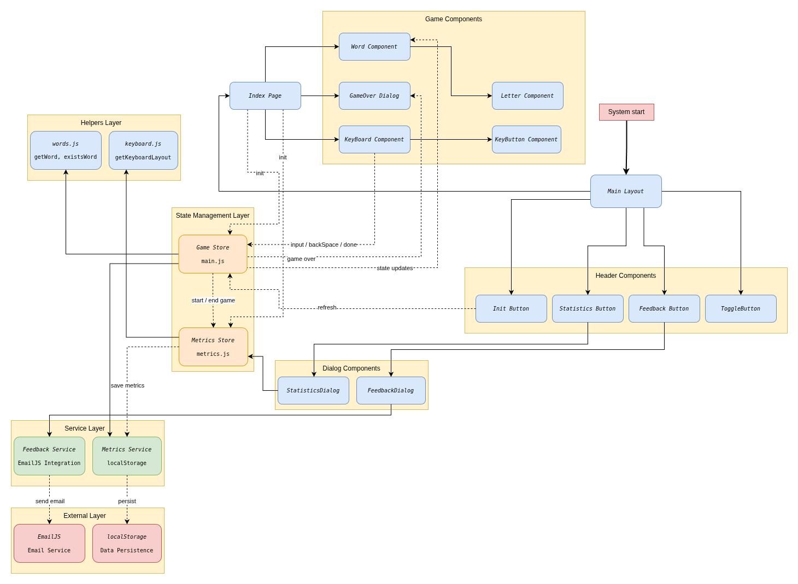

# Architecture Documentation

## System Architecture

- **Frontend**: Vue 3 + Quasar Framework
- **State Management**: Pinia
- **Mobile**: Capacitor (Android)
- **Build**: Vite

## Architecture Diagram

## Component Structure

### Layout Components

- `MainLayout.vue` - App shell with header toolbar
  - Contains: InitButton, FeedbackButton, StatisticsButton, ToggleButton

### Page Components

- `IndexPage.vue` - Main game page
  - Contains: Word components, Keyboard, GameOver dialog

### Game Components

- `Word.vue` - Individual word row component (displays 6 word attempts)
- `Letter.vue` - Individual letter cell within a word
- `Keyboard.vue` - Virtual keyboard with Russian layout
- `KeyButton.vue` - Individual keyboard key button
- `GameOver.vue` - End game dialog (win/lose message)

### Dialog Components

- `FeedbackDialog.vue` - User feedback form (rating + comment)
  - Shown automatically after game completion (with rate limiting: once per 7 days)
  - Can also be opened manually via FeedbackButton
- `StatisticsDialog.vue` - Game statistics display

### Button Components

- `InitButton.vue` - New game button
- `FeedbackButton.vue` - Opens feedback dialog
- `StatisticsButton.vue` - Opens statistics dialog
- `ToggleButton.vue` - Dark mode toggle

## State Management (Pinia Stores)

### Game Store (`stores/main.js`)

- **State**: target word, currentWord, currentIndex, words array, gameOver, gameWin
- **Actions**: init(), input(), backSpace(), done(), win(), lose()
- **Getters**: empty, full, allL, equalL

### Metrics Store (`stores/metrics.js`)

- **State**: totalGames, totalWins, totalLosses, totalTime, lastGameTime
- **Actions**: init(), startGame(), endGame(isWin), reset()
- **Getters**: winRate, averageGameTime, formattedStats

## Services

### Feedback Service (`services/feedback.js`)

- Sends user feedback via EmailJS
- Collects device information
- Handles email template parameters

### Metrics Service (`services/metrics.js`)

- Tracks game start/end timestamps
- Calculates game duration
- Persists metrics to localStorage
- Manages statistics aggregation

## Helpers

### Words Helper (`helpers/words.js`)

- `getWord()` - Returns random word from dictionary (uppercase)
- `existsWord(word)` - Validates if word exists in dictionary

### Keyboard Helper (`helpers/keyboard.js`)

- `getKeyboardLayout({ row })` - Returns keyboard layout for specified row

## Data Flow

1. **Game Initialization**

   - User clicks InitButton → `gameStore.init()` → `metricsStore.startGame()`
   - Game store generates target word, initializes word slots
   - Metrics store records start timestamp
2. **User Input Flow**

   - User clicks keyboard → `KeyButton` → `Keyboard` → `gameStore.input()`
   - Store updates currentWord → Reactive components re-render
   - `Word` and `Letter` components display updated state
3. **Word Validation**

   - User submits word → `gameStore.done()` → `existsWord()` helper
   - Valid word: advance to next attempt or win/lose
   - Invalid word: show error state
4. **Game End**

   - Win/Lose → `gameStore.win()`/`lose()` → `metricsStore.endGame()`
   - Metrics service calculates duration, updates statistics
   - Statistics saved to localStorage
   - `GameOver` dialog displays result
   - After 2 seconds, `FeedbackDialog` automatically prompts (if 7+ days since last prompt)
5. **Feedback Flow**

   - User clicks FeedbackButton → Opens FeedbackDialog
   - User submits feedback → FeedbackService → EmailJS → Email sent
6. **Statistics Flow**

   - User clicks StatisticsButton → Opens StatisticsDialog
   - MetricsStore loads data from localStorage
   - Formatted statistics displayed to user

## External Integrations

- **EmailJS**: Email service for user feedback
- **localStorage**: Browser/Android storage for metrics persistence and feedback prompt tracking
- **Capacitor**: Mobile app wrapper for Android deployment

## Monitoring & Reliability

### Metrics Tracking

- **Game Statistics**: Total games, wins, losses, win rate
- **Time Tracking**: Per-game time, average time, last game time
- **Persistence**: All metrics stored in localStorage (works on Android/Capacitor)

### User Feedback

- **Manual Feedback**: Available via FeedbackButton anytime
- **Periodic Prompts**: Automatic feedback prompt after game completion (once per 7 days)
- **Email Integration**: Feedback sent to configured email address via EmailJS
