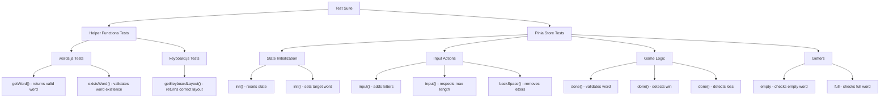

# Test Documentation

## Overview

This project uses [Vitest](https://vitest.dev/) for unit testing. Tests focus on core game logic: helper functions and Pinia store.

## Test Architecture



## Test Files

### 1. `src/helpers/__tests__/words.spec.js`

Tests for word-related helper functions.

**`getWord()` tests:**
- Returns a string
- Returns uppercase word
- Returns word with length 5
- Returns different words on multiple calls (randomness)

**`existsWord()` tests:**
- Returns true for valid words (lowercase, uppercase, mixed case)
- Returns false for invalid words
- Returns false for empty string
- Returns false for words with wrong length

### 2. `src/helpers/__tests__/keyboard.spec.js`

Tests for keyboard layout helper function.

**`getKeyboardLayout()` tests:**
- Returns correct layout for row 0 (12 keys: ЙЦУКЕНГШЩЗХЪ)
- Returns correct layout for row 1 (11 keys: ФЫВАПРОЛДЖЭ)
- Returns correct layout for row 2 (10 keys: ЯЧСМИТЬБЮ)
- Each key has correct structure (key and label properties)
- Throws error for invalid row index (too high or negative)

### 3. `src/stores/__tests__/main.spec.js`

Tests for Pinia game store.

**`init()` tests:**
- Initializes game state correctly
- Creates 6 word slots with proper structure
- Resets state when called multiple times

**`input()` tests:**
- Adds letter to current word
- Does not exceed max length of 5
- Updates current word in words array

**`backSpace()` tests:**
- Removes last letter from current word
- Does not remove if word is empty
- Resets exist flag to true

**`done()` tests:**
- Validates word and marks as checked if valid
- Sets exist to false for invalid words
- Advances to next word if valid and not winning
- Triggers win when word matches target
- Triggers lose on last attempt with wrong word

**`win()` and `lose()` tests:**
- Sets gameWin and gameOver correctly

**Getters tests:**
- `empty`: Returns true when currentWord is empty
- `full`: Returns true when currentWord has 5 letters
- `allL`: Returns unique letters from all previous words
- `equalL`: Returns letters that match target position

## Running Tests

### Run tests once
```bash
npm test
```

### Run tests in watch mode (for development)
```bash
npm run test:watch
```

### Run tests with coverage report
```bash
npm run test:coverage
```

## Test Configuration

- **Framework**: Vitest
- **Environment**: jsdom (for DOM simulation)
- **Vue Testing**: @vue/test-utils
- **Pinia Testing**: @pinia/testing

Configuration files:
- `vitest.config.js` - Main Vitest configuration
- `vitest.setup.js` - Test setup and global mocks

## Android/Capacitor Compatibility

Tests run in Node.js environment (not on Android device). All tested code is JavaScript/Vue, which is fully compatible with Capacitor. The tests verify the game logic that will run identically on both web and mobile platforms.

## Coverage Goals

- **Helper Functions**: 100% coverage (simple, pure functions)
- **Pinia Store**: Core game logic paths (init, input, backSpace, done, win/lose)
- **Getters**: All getters tested

## Notes

- Tests use mocks for `uuid` and `words.js` helpers to ensure predictable test results
- Store tests create a fresh Pinia instance for each test to avoid state pollution
- All tests are isolated and can run in any order

